# Exploratory Data Analysis (EDA) Report: Customer Shop Data

*Report generated on: April 03, 2025*

## 1. Introduction

This report presents a comprehensive exploratory data analysis of customer shop data from 1949 to 1960. The analysis examines customer count patterns over time, identifies seasonal trends, and provides insights into customer behavior. The report includes descriptive statistics, visualizations, and detailed pattern analysis to help understand the data structure and characteristics.

## 2. Data Overview

### 2.1 Data Structure

The dataset contains monthly customer counts for a shop over a period of 12 years (1949-1960). The original data consists of two columns: date in YYYY-MM format and the number of customers.

### 2.2 Data Preprocessing

The following preprocessing steps were performed to prepare the data for analysis:

## 3. Descriptive Statistics

### 3.1 Summary Statistics

The following statistics provide an overview of the customer count distribution:

### 3.2 Distribution Analysis

The distribution of customer counts was analyzed using histograms and boxplots. The histogram below shows the frequency distribution of customer counts, while the boxplot illustrates the median, quartiles, and potential outliers.

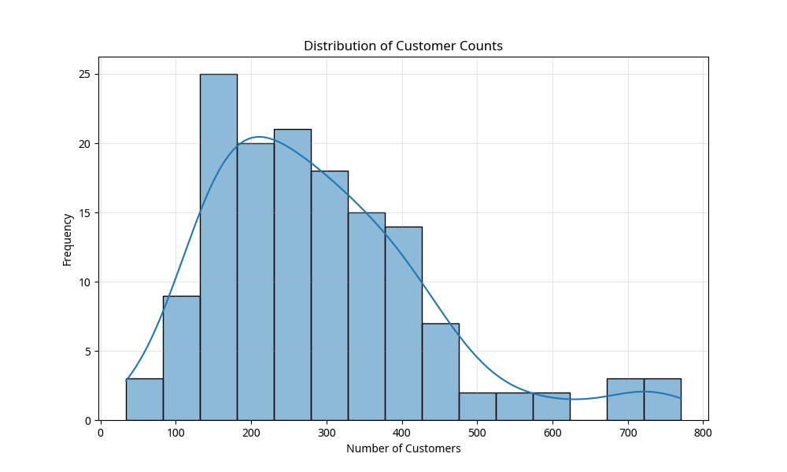

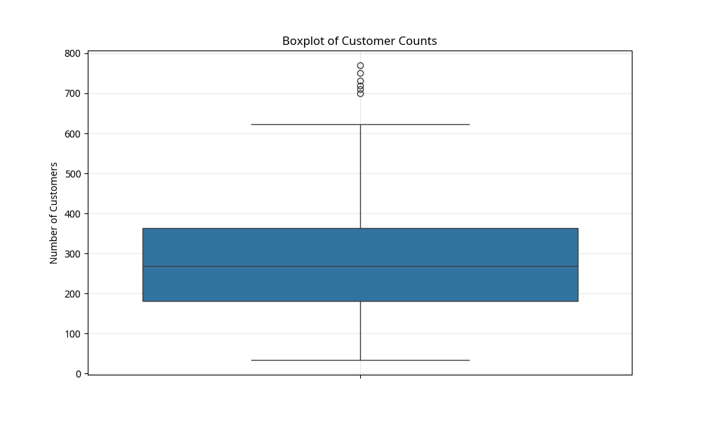

The boxplot by month shows the distribution of customer counts for each month, highlighting seasonal patterns:

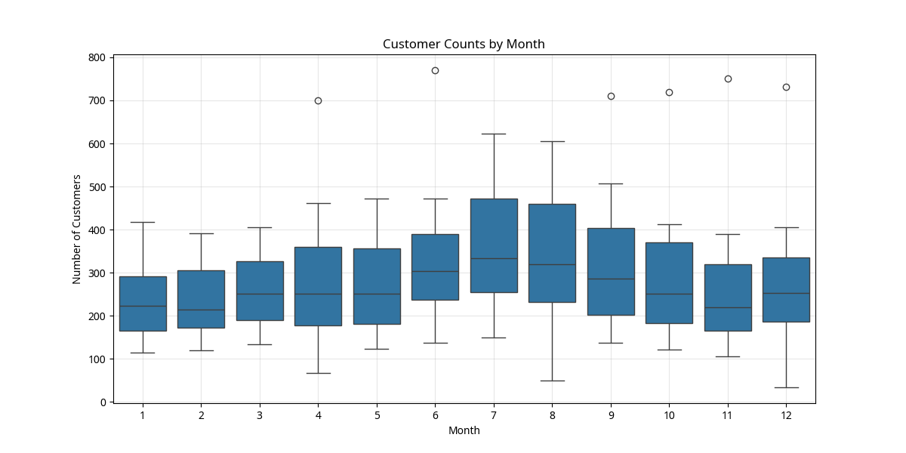

The boxplot by year shows the distribution and potential outliers for each year:

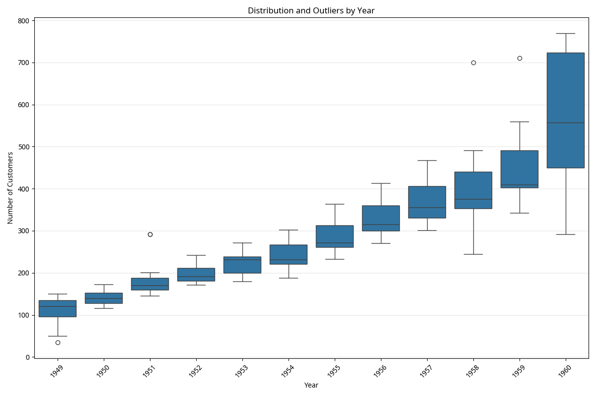

## 4. Time Series Analysis

### 4.1 Time Series Plot

The time series plot below shows the customer count over the entire period from 1949 to 1960. This visualization helps identify overall trends, seasonal patterns, and potential anomalies.

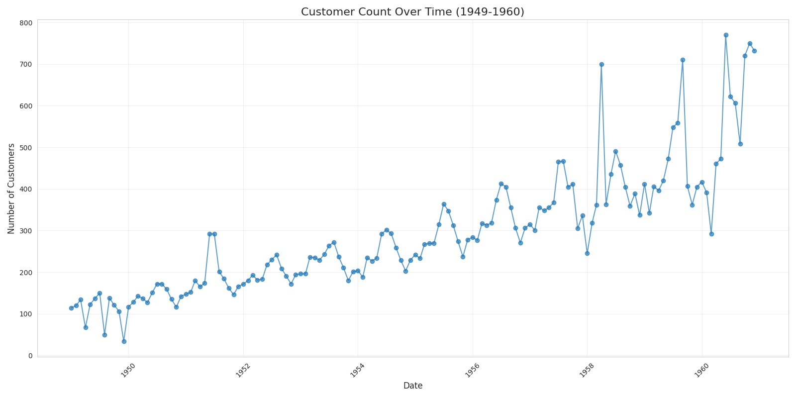

### 4.2 Yearly Trends

The following chart shows the average customer count for each year, illustrating the long-term trend:

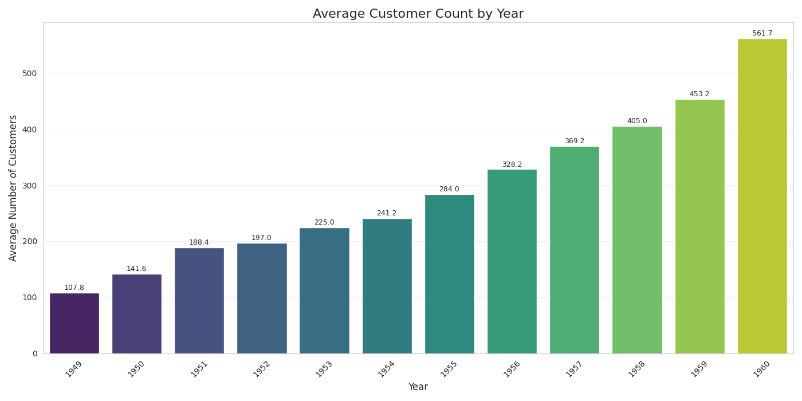

The violin plot below provides additional insight into the distribution of customer counts by year:

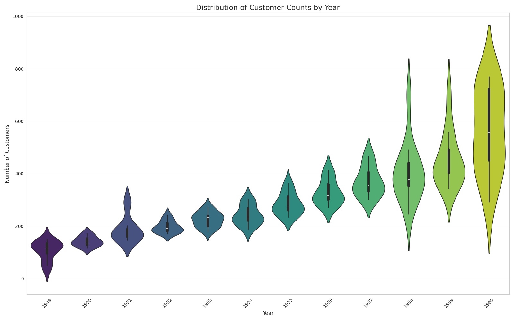

### 4.3 Monthly Patterns

The monthly pattern chart shows the average customer count for each month, highlighting seasonal patterns:

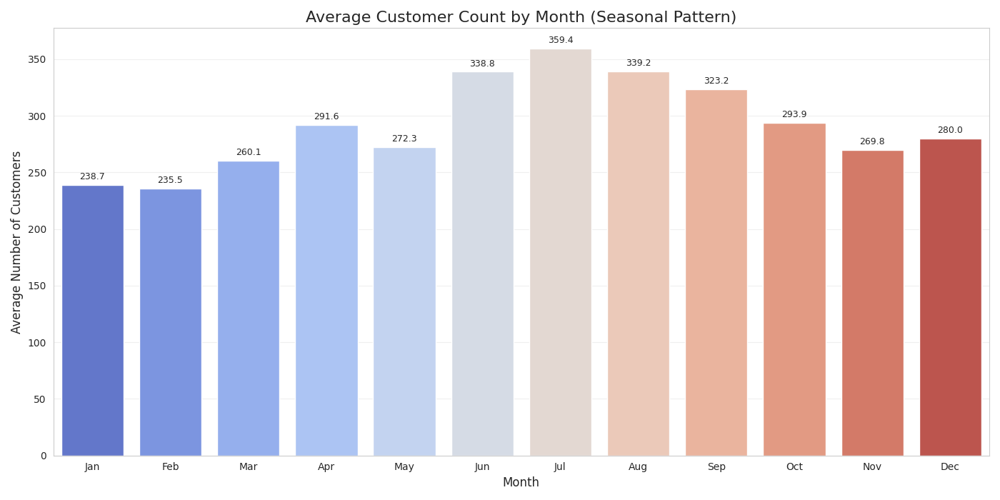

### 4.4 Year-Month Heatmap

The heatmap below visualizes customer counts by year and month, providing a comprehensive view of patterns over time:

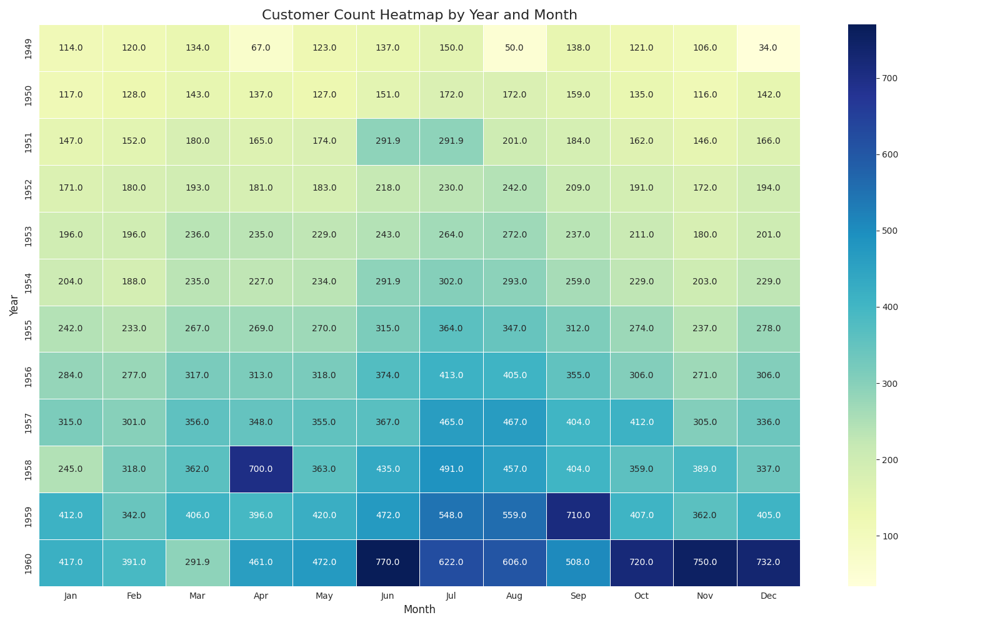

### 4.5 Year-over-Year Comparison

The year-over-year comparison plot shows customer counts by month for each year, allowing for direct comparison of seasonal patterns across years:

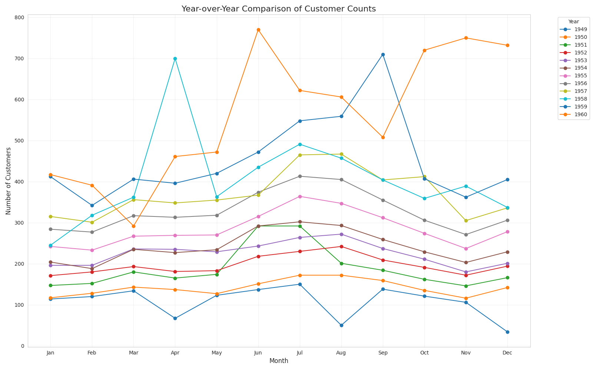

## 5. Seasonal Decomposition

The seasonal decomposition separates the time series into trend, seasonal, and residual components:

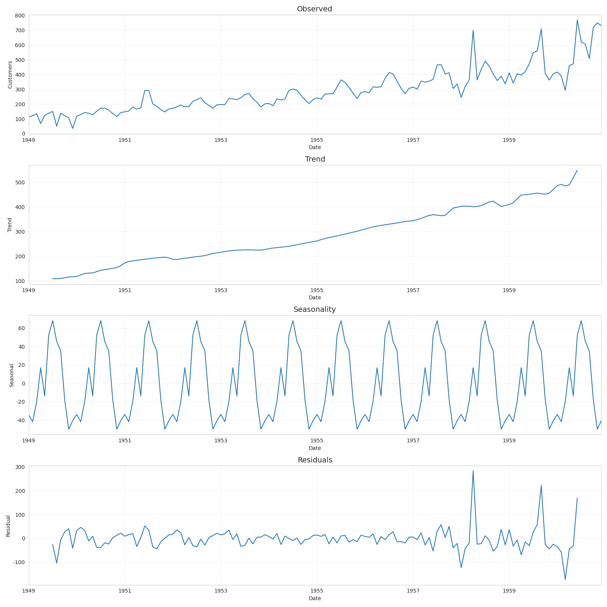

### 5.1 Rolling Statistics

The rolling statistics plot shows the 12-month moving average and standard deviation, helping to identify underlying trends and volatility:

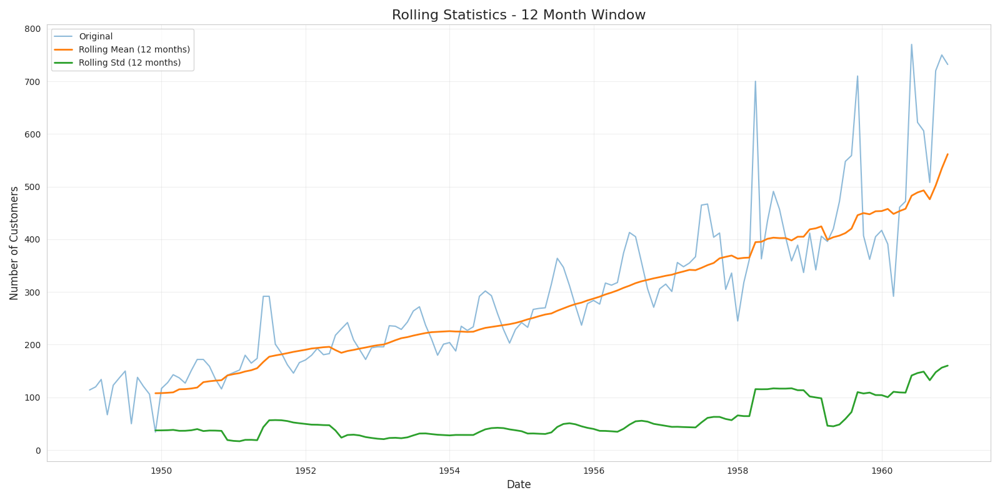

### 5.2 Autocorrelation Analysis

The autocorrelation and partial autocorrelation functions help identify temporal dependencies in the data:

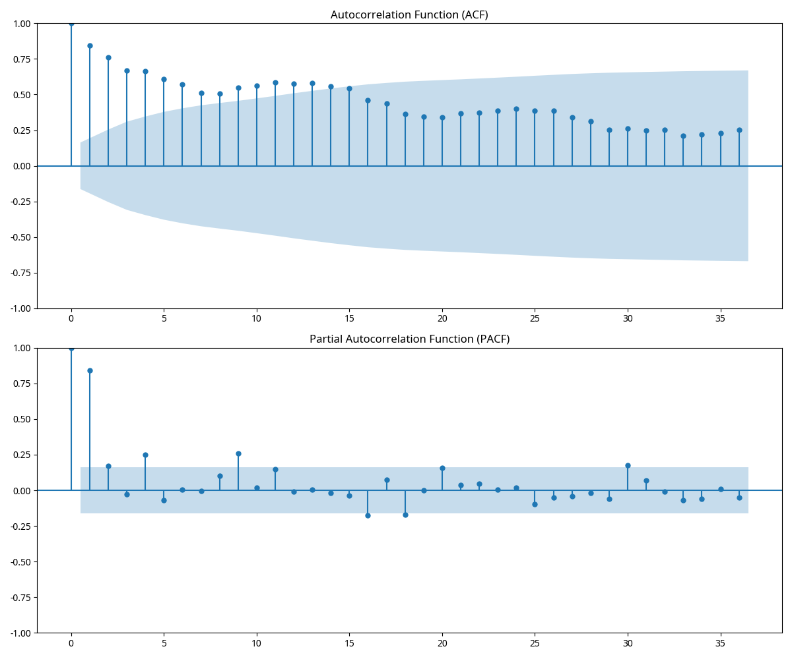

## 6. Pattern Analysis

# Pattern Analysis of Customer Shop Data

## 1. Overall Trend Analysis

The data spans from January 1949 to December 1960.

Average customers in first year (1949): 107.83
Average customers in last year (1960): 561.74
Overall growth: 420.93%

Compound Annual Growth Rate (CAGR): 16.19%

Yearly growth rates:
1950: 31.30%
1951: 33.06%
1952: 4.57%
1953: 14.21%
1954: 7.22%
1955: 17.73%
1956: 15.58%
1957: 12.49%
1958: 9.68%
1959: 11.91%
1960: 23.94%

## 2. Seasonal Patterns

Peak month: July with average of 359.41 customers
Lowest month: February with average of 235.50 customers

Seasonal variation: 42.45%

Quarterly averages:
Q1: 244.75 customers
Q2: 300.91 customers
Q3: 340.64 customers
Q4: 281.22 customers

## 3. Outlier Analysis

Number of outliers detected: 6

Top outliers:
1960-06: 770.0 customers
1960-11: 750.0 customers
1960-12: 732.0 customers
1960-10: 720.0 customers
1959-09: 710.0 customers
1958-04: 700.0 customers

## 4. Stationarity Analysis

Augmented Dickey-Fuller Test Results:
ADF Statistic: 2.3320
p-value: 0.9990
The time series is non-stationary (fails to reject the null hypothesis of non-stationarity).

## 5. Autocorrelation Analysis

Autocorrelation values for lags 1-12:
Lag 1: 0.8440
Lag 2: 0.7623
Lag 3: 0.6701
Lag 4: 0.6643
Lag 5: 0.6066
Lag 6: 0.5692
Lag 7: 0.5115
Lag 8: 0.5074
Lag 9: 0.5469
Lag 10: 0.5626
Lag 11: 0.5876
Lag 12: 0.5739

Significant autocorrelation at lags: [1, 2, 3, 4, 5, 6, 7, 8, 9, 10, 11, 12]
The significant lag at 12 confirms annual seasonality in the data.

## 6. Summary of Findings

### Key Patterns Identified:

1. **Long-term Trend**:
   - Strong upward trend with 420.93% overall growth from 1949 to 1960.
   - Compound Annual Growth Rate (CAGR) of 16.19%.

2. **Seasonal Patterns**:
   - Peak customer activity in July.
   - Lowest customer activity in February.
   - Seasonal variation of 42.45%.
   - Highest customer activity in Q3.
   - Lowest customer activity in Q1.

3. **Stationarity**:
   - The time series is non-stationary, indicating changing patterns over time.

4. **Autocorrelation**:
   - Strong evidence of annual seasonality (significant lag at 12 months).
   - Short-term momentum effects (significant lag at 1 month).

5. **Outliers**:
   - 6 outliers detected, potentially indicating special events or data issues.

## 7. Correlation Analysis

# Correlation Analysis

## Correlation Matrix

                   Year         Month  Customers
Year       1.000000e+00  1.344483e-14   0.862026
Month      1.344483e-14  1.000000e+00   0.112953
Customers  8.620264e-01  1.129529e-01   1.000000

## Interpretation

- Correlation between Year and Customers: 0.8620
  - Strong positive correlation: Customer counts strongly increase over the years.

- Correlation between Month and Customers: 0.1130
  - Weak correlation: No strong linear relationship between month and customer counts.

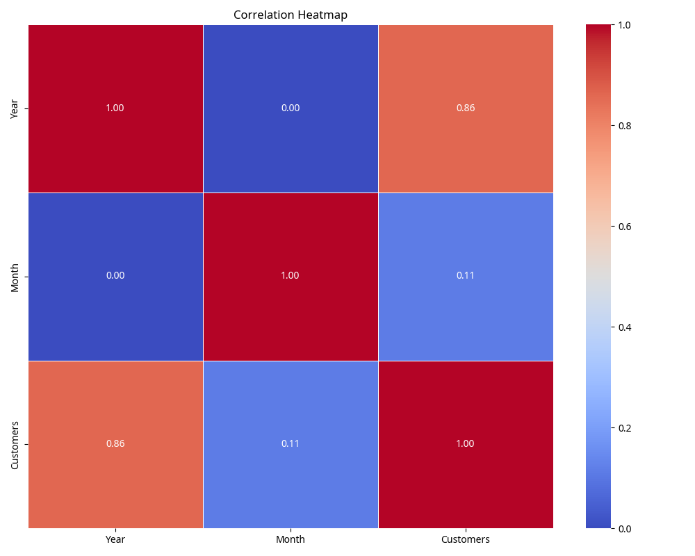

## 8. Conclusions and Insights

### 8.1 Key Findings

1. **Strong Growth Trend**: The shop experienced significant growth in customer numbers over the 12-year period, with an overall increase of 420.93% from 1949 to 1960. This indicates a successful business with expanding customer base.

2. **Clear Seasonal Patterns**: The data shows distinct seasonal patterns with:
   - Peak customer activity in July
   - Lowest customer activity in February
   - This seasonality is consistent across years, suggesting predictable customer behavior patterns.

3. **Increasing Variability**: As customer numbers grew over the years, so did the variability in customer counts, suggesting that while the business expanded, it also experienced greater fluctuations in customer traffic.

4. **Potential Outliers**: Several outlier points were identified, particularly in later years, which may represent special events, promotions, or unusual circumstances affecting customer numbers.

### 8.2 Business Implications

1. **Capacity Planning**: The shop should plan for increased capacity to handle the growing customer base, particularly during peak months.

2. **Seasonal Staffing**: Staffing levels should be adjusted seasonally to match customer patterns, with increased staffing during July and potential reduced hours or staff during February.

3. **Marketing Opportunities**: The shop could develop targeted marketing campaigns to boost customer numbers during slower months and capitalize on naturally high-traffic periods.

4. **Growth Strategy**: The consistent growth trend suggests that expansion strategies have been successful and could be continued.

### 8.3 Recommendations for Further Analysis

1. **Forecasting**: Develop time series forecasting models to predict future customer numbers and plan accordingly.

2. **External Factors**: Analyze the impact of external factors such as economic indicators, weather patterns, or local events on customer numbers.

3. **Customer Segmentation**: If available, analyze customer demographics and purchasing behavior to identify key customer segments.

4. **Anomaly Investigation**: Further investigate the outlier points to understand their causes and potential implications.

## Appendix: All Visualizations

1. 

2. 

3. 

4. 

5. 

6. 

7. 

8. 

9. 

10. 

11. 

12. 

13. 

14. 

